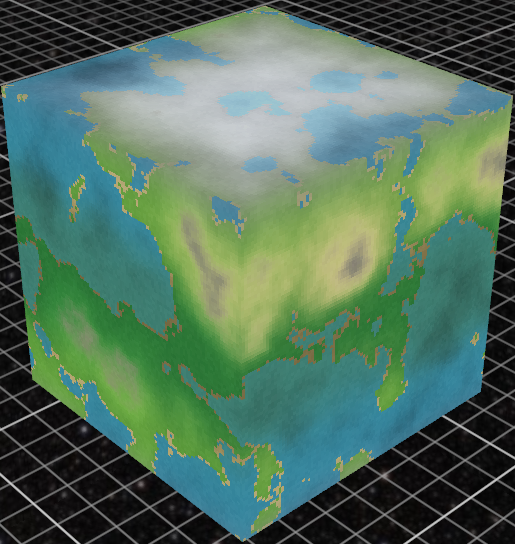
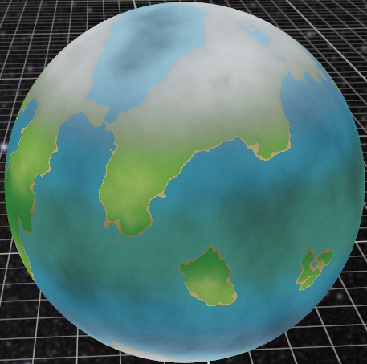

Planet texture generator
===




A quickly put together planet texture generator (just for you, DEA__TH)

Feature list
---

- spherical and cubical representation
- uint32 seed
- procedural generation
- dynamic biomes
- variable resolution

ogl setup
===

There is some boilerplate code that i branch from when i need to do something with opengl fast.

building
===

uses cmake:

``` shell
cmake -S . -B build
cmake --build build
build/main
```
